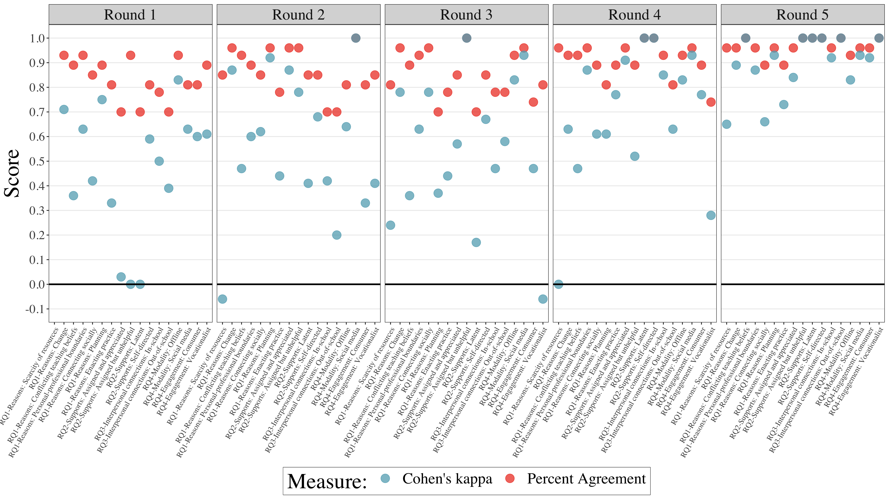
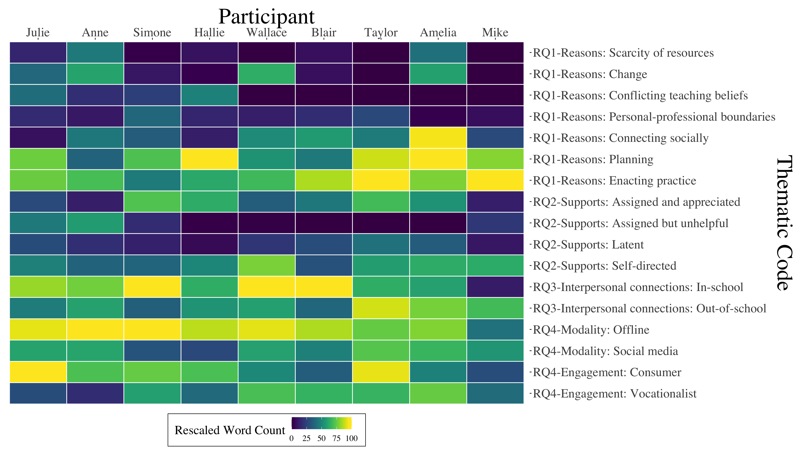
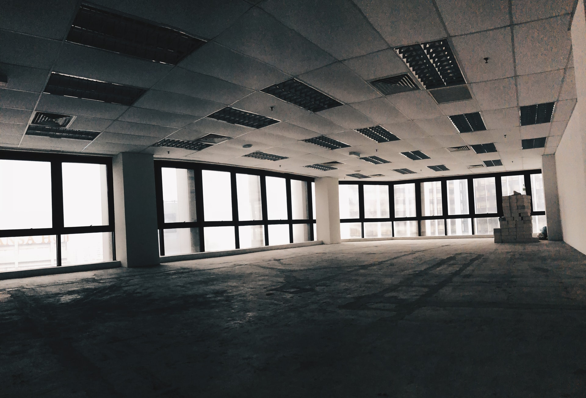

```{r setup, include=FALSE}
usethis::use_git_ignore(c("*.csv", "*.rds"))
options(htmltools.dir.version = FALSE)

#titleSlideClass: [inverse, center, middle]
#"default", "metropolis", "metropolis-fonts", 

# see options for customize slides: 
# https://slides.yihui.name/xaringan/
# https://slides.yihui.name/xaringan/incremental.html
# https://github.com/yihui/xaringan/wiki

library(knitr)
library(tidyverse)
library(xaringan)
```

class: inverse, center, middle

**View Slides:** [bretsw.github.io/aect20-new-teachers](https://bretsw.github.io/aect20-new-teachers)

**Connect on Twitter:** [@bretsw](https://twitter.com/bretsw)

---

class: inverse, center, middle

# Teacher Induction

---

# Induction

### New teachers' transition from preparation to practice

```{r, out.width = "720px", echo = FALSE, fig.align = "center"}
include_graphics("img/teacher.jpg")
```

---

# Induction

### Tension between two worlds about *what* and *how* to teach

```{r, out.width = "600px", echo = FALSE, fig.align = "center"}

```

--

1. Teacher preparation program

--

1. School of employment

---

# Induction

### Social media: From two worlds to many worlds

```{r, out.width = "720px", echo = FALSE, fig.align = "center"}

```

---

# Induction

### A universe

```{r, out.width = "720px", echo = FALSE, fig.align = "center"}
include_graphics("img/universe.jpg")
```

---

# Induction

### An edu-verse

Where many voices offer ideas about *what* and *how* to teach

```{r, out.width = "700px", echo = FALSE, fig.align = "center"}

```

---

# Purpose

```{r, out.width = "420px", echo = FALSE, fig.align = "center"}
include_graphics("img/purpose.jpg")
```

--

### The purpose of this study is to explore:

--

- what supports for professional learning new teachers seek during induction 

--

- how they use social media with the intention of seeking these supports 

--

- *how and why new teachers navigate the edu-verse looking for help with induction challenges*

---

class: inverse, center, middle

# Framework

---

# Professional Learning Networks

```{r, out.width = "480x", echo = FALSE, fig.align = "center"}
include_graphics("img/network.jpg")
```

--

### PLNs are systems of: 

--

- interpersonal **connections** 

--

- and **resources** (knowledge, skills, curricular materials, and encouragement)

--

- that support **informal learning** (Trust, 2012)

---

# Perspectives on PLNs

```{r, out.width = "480px", echo = FALSE, fig.align = "center"}

```

--

- **Learning ecologies perspective:**

--

  - How do disparate pieces of a new teacher's PLN fit together?
  
--

- **Agentic perspective:**

--

  - How does a new teacher put the pieces of their PLN together?

---

# Research Questions

```{r, out.width = "360px", echo = FALSE, fig.align = "center"}
include_graphics("img/question.jpg")
```

--

1. What **reasons**, if any, do new teachers report for seeking induction supports, and what reasons do they give, if any, for not seeking induction supports?

--

1. What **supports** for professional learning, if any, are new teachers seeking during induction?

--

1. What **interpersonal connections** do new teachers make when seeking supports for professional learning during induction?

--

1. How, if at all, do new teachers use social media as a **modality** to access supports for professional learning during induction?

---

class: inverse, center, middle

# Method

---

# Participants

```{r, out.width = "360px", echo = FALSE, fig.align = "center"}
include_graphics("img/teaching.jpg")
```

--

- MSU College of Education Master's degree students

--

- 0-3 years experience

--

- Teaching in U.S. (geographically dispersed)

--

- Represent distinct backgrounds and experiences: specialists, itinerants, starting mid-year

---

# Data collection

```{r, out.width = "720px", echo = FALSE, fig.align = "center"}
include_graphics("img/interview.jpg")
```

--

- Conducted semi-structured interviews (*n* = 9)

---

# Data analysis

--

- Transcribed and coded: 5 rounds

--

- Tested inter-rater reliability: 5 rounds

--

```{r, out.width = "840px", echo = FALSE, fig.align = "center"}

```

---

class: inverse, center, middle

# Results

---

# Themes by Participant

```{r, out.width = "840px", echo = FALSE, fig.align = "center"}

```

---

# RQ1. Reasons for Seeking

### Environmental Factors

```{r, out.width = "400", echo = FALSE, fig.align = "center"}

```

--

- Scarcity of resources
  
--

- Change, disruptions, and uncertainty 

--

> First year teaching, it was all new curriculum. And then, second year teaching, new science curriculum, rolling into the reading and writing curriculum, then I'm piloting a new math curriculum. So it's a lot, yeah, trying to adjust to that...

---

# RQ1. Reasons for Seeking

### Personal Factors

```{r, out.width = "480px", echo = FALSE, fig.align = "center"}

```

--

- Conflicting teaching beliefs, dissonance with more experienced colleagues

--

> I have one teacher who just wants to use curriculum from 30 years ago. And I'm just like, "I can't do it." There are just completely irrelevant things.

---

# RQ1. Reasons for Seeking

### Behavioral Factors

--

- Maintaining boundaries between personal and professional life

--

- Connecting socially: *social glue*  (positive) and *social comparison* (negative)

--

- Planning

--

- Enacting practice

--

> Back to the Instagram thing, I do follow some teacher accounts. Sometimes I feel like, it makes me feel like a crappy teacher, because I'm seeing them do all these things. And I'm like, “I'm tired right now. If I did all those things, I would either never sleep, or I would be just doing those things. I wouldn't be able to follow through with them and actually teach with those tools that they're spending hours making on the weekend.”

---

# RQ2. Induction Supports

### Assigned Supports

```{r, out.width = "420px", echo = FALSE, fig.align = "center"}
include_graphics("img/help.jpg")
```

--

> I had our eighth grade science teacher for part of my mentorship too, which was nice because she was teaching the same kids that I was. So it was more like we communicated about students there. And seventh grade English, I communicate more about English stuff there. And then with the sixth grade history teacher, we don't really have much in common, but it was nice to just see a completely different successful way of teaching… I like having all those different mentors.

---

# RQ2. Induction Supports

### Latent Supports

```{r, out.width = "420px", echo = FALSE, fig.align = "center"}

```

--

> There were times when different teachers, like that one teacher I really liked working with, would say, “Oh, if you ever have downtime, you can just come to my classroom and observe or help out so you get more experience.” And, and in the moment I was like, “Yeah, that's a great idea!” But then like, when the time actually came, I was like, “No, I don't want to go work when I'm not working.”

---

# RQ2. Induction Supports

### Self-directed Supports

```{r, out.width = "420px", echo = FALSE, fig.align = "center"}
include_graphics("img/self-directed.jpg")
```

--

> No, I pretty much always was reaching out to whoever would help me. I kind of knew, like you said, the challenges were there and I was looking out for help, any way I could get it at that time… I feel like it's a cheap answer, but I just can't think of a time that I didn't ask someone for help. Even if it was my wife, or I don't know... I can't think of any time that I would just fail and just accept it and not reach out.

---

# RQ3. Interpersonal Connections

### In-school Connections

```{r, out.width = "420px", echo = FALSE, fig.align = "center"}
include_graphics("img/community.jpg")
```

--

* Professional learning communities (PLCs) - by grade or by subject

--

* Mentor teachers

--

* Partner teachers

--

* Support staff / paraeducators

---

# RQ3. Interpersonal Connections

### Out-of-school Connections

```{r, out.width = "300px", echo = FALSE, fig.align = "center"}
include_graphics("img/horizon.jpg")
```

--

- District-wide professional development gatherings

--

- District and national Facebook groups

--

- National organizations

--

- YouTube channels

--

> It’s always nice to see what other teachers are dealing with in their district or their state like, “Are you, are you experiencing these same things?” And they are, and it's nice to know that you're not the only one.

---

# RQ4. Social Media

### Social Media Modalities

```{r, out.width = "540px", echo = FALSE, fig.align = "center"}
include_graphics("img/social-media-phone.jpg")
```

--

- Social networking sites: Facebook, Twitter, and LinkedIn

--

- Content sharing sites: Instagram, Pinterest, and TeachersPayTeachers

--

- Group messengers: Slack, Microsoft Teams, and email listservs.

---

# RQ4. Social Media

### Ways of Engaging

--

- **Consumer:** seeks support for self-interested reasons

--

> I have a Pinterest for the sole purpose of teaching. So, again, I don't engage with it, I don't go on and search for things. I have it set up where it sends me one email a day with about 10 different math activities or blog posts, whatever you want to call it, over the courses I teach.

--

- **Vocationalist:** seeks support by participating as a member of a learning community

--

> We're able to bounce ideas off of one another. But there's definitely that, you know, if we have someone telling us something about the PE department, it's like the whole PE department versus everyone else. We have that group mentality.

---

class: inverse, center, middle

# Discussion

---

# Ecological Perspective on PLNs

```{r, out.width = "480px", echo = FALSE, fig.align = "center"}
include_graphics("img/social-media.jpg")
```

--

- Teaching is complicated by contextual challenges

--

- New teachers navigate intricate systems with numerous interconnected pieces that mutually influence one anther

--

- New teachers reported seeking different supports for different purposes

--

- Learning ecologies change over time

---

# Agentic Perspective on PLNs

```{r, out.width = "420px", echo = FALSE, fig.align = "center"}
include_graphics("img/self-directed.jpg")
```

--

- New teachers must take initiative to decide from whom to learn

--

- New teachers must navigate tensions and reconcile differences

--

  - Individual vs. group identity

--

  - Global vs. local applications 

--

  - Context collapse

---

# Significance

```{r, out.width = "600px", echo = FALSE, fig.align = "center"}
include_graphics("img/teacher.jpg")
```

### For new teachers

--

- Understand the complexity and convergence of tensions felt by new teachers 

--

- Observe peers’ experiences, such as the types of induction challenges to anticipate

---

# Significance

```{r, out.width = "420px", echo = FALSE, fig.align = "center"}
include_graphics("img/help.jpg")
```

### For teacher educators and education leaders

--

- **Sustain** new teachers by attending to their lived experiences, not just **retain** them

--

- Nurture the finite resource of new teachers’ agency

--

- Passion alone is not enough to sustain teaching careers

---

class: inverse, center, middle

# Conclusion

---

# Conclusion

```{r, out.width = "300px", echo = FALSE, fig.align = "center"}

```

--

- Social media create new opportunities and new tensions 

--

- This study provides insight into:

--

  - the challenges new teachers face, 

--

  - the array of available options, and 

--

  - new teachers’ capacity to take initiative and follow up on available supports. 

--

- The edu-verse continues to expand: New teachers’ and education leaders’ understanding of emerging learning ecologies and agency must expand as well.

---

# Questions?

```{r, out.width = "360px", echo = FALSE, fig.align = "center"}
include_graphics("img/question.jpg")
```

- **Email:** [staudtwi@msu.edu](mailto:staudtwi@msu.edu)

- **Twitter:** [@bretsw](https://twitter.com/bretsw)

- **Web:** [bretsw.com](http://bretsw.com)

- **Slides:** https://bretsw.github.io/aect20-new-teachers